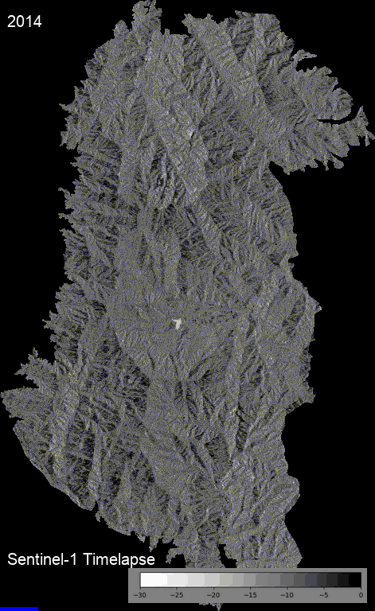
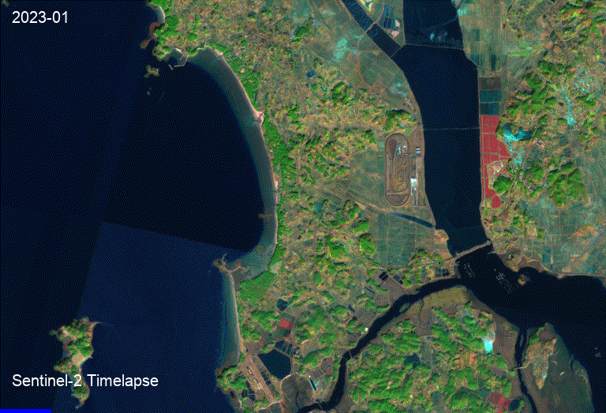

# 'Eye of Bandal' Korean National Park AI Solution Service
### Sentinel Satellite Based Nature Change Detection Platform Using Geemap 

  

# Function
### Satellite Based Change Detection
1. Environmental Management
   - Timelapse
  

    
    
  

   - Surface Change Detection
   

  
  

     
2. Resource Monitoring
   - Vegetation Index Analysis/Prediction
   - Soil Profiling(Component Content/Moisture Content)
   - Water Resource Management(Precipitation/Groundwater Recharge Rate)
      
3. Disaster/Safety
   - Landslide Susceptibility Map(Of South Korea)

# How to run

# Tool
Language : Python
AI Model : Prophet(Meta), Google Earth Engine Classifier
Web : Streamlit

# Development Period
Ver.1 : 2023.10.20 ~ 2023.11.29
Ver.2(Update) : 2023.11.30 ~ 2023.12.20

# Especially Thanks to
- Yoo Byeong Hyuk
- Crego, R. D., Stabach, J. A., & Connette, G.
For sharing the great resource on online, the 'code'! We would be nothing without your codes.

