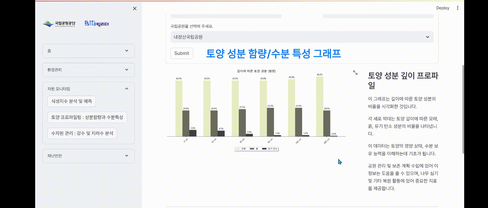

# 'Eye of Bandal' Korean National Park AI Solution Service
### Sentinel Satellite Based Nature Change Detection Platform 
#### Using Geemap 

  

### Function
#### Satellite Based Change Detection
- Environmental Management
   1. Timelapse
  

  
  

  
  

    
    
  

  
   2. Surface Change Detection
   

  
  

- Resource Monitoring
   1. Vegetation Index Analysis/Prediction
  

  
  

     
   2. Soil Profiling(Component Content/Moisture Content)
  

  
  

  
   3. Water Resource Management(Precipitation/Groundwater Recharge Rate)
  

  
  

  
- Disaster/Safety
  Landslide Susceptibility Map(of South Korea)
  

  
  

  
### How to run

### Tool
- Language : Python
- AI Model : Prophet(Meta), Google Earth Engine Classifier
- Web : Streamlit

### Development Period
- Ver.1 : 2023.10.20 ~ 2023.11.29
- Ver.2 : 2023.11.30 ~ 2023.12.20

### Especially Thanks to
- Yoo Byeong Hyuk
- Crego, R. D., Stabach, J. A., & Connette, G.
#### for sharing the great resource on online, the 'code'! We would be nothing without your codes.

